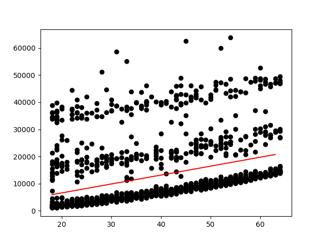

# Linear Regression from Scratch

The implementation in this directory is a simple linear regression model that uses the gradient descent algorithm to find the best fit line for a given dataset. The model is trained on a single variable `age` from a the medical cost insurance dataset to find the trend in the `charges`. The results are plotted using matplotlib. Instead of choosing `age` you can choose any other variable from the dataset, although I found `age` to have a clear relation with `charges`.

## Mathematical Formulation

The linear regression model is given by the equation:

```
y = mx + b
```

where `y` is the dependent variable, `x` is the independent variable, `m` is the slope of the line, and `b` is the y-intercept.

The cost function for linear regression is given by the mean squared error (MSE) formula:

```
MSE = (1/n) * Σ(y - (mx + b))^2
```

where `n` is the number of data points.

The gradient descent algorithm is used to minimize the cost function by updating the weights `m` and `b` using the following formulas:

```
m = m - α * (1/n) * Σ(-2x(y - (mx + b)))
b = b - α * (1/n) * Σ(-2(y - (mx + b)))
```

where `α` is the learning rate.

## Results

The following plot shows the best fit line for `charges` based on the `age` of the patients in the dataset:



## Dependencies

- pandas==2.2.2
- matplotlib==3.8.2

## Usage

To run the code, simply clone the repository and run the following command:

```bash
cd ml-from-scratch
cd linear-regression
python3 single_var.py
```

## Discussion

The linear regression model is a simple model that can be used to find the relationship between two variables. In this case, we used the `age` of the patients to predict the `charges` based on the trend in the data. The model can be further improved by using multiple variables and more complex models like polynomial regression or neural networks. We will use multiple variables in the next implementation to see if we can improve the accuracy of the model.